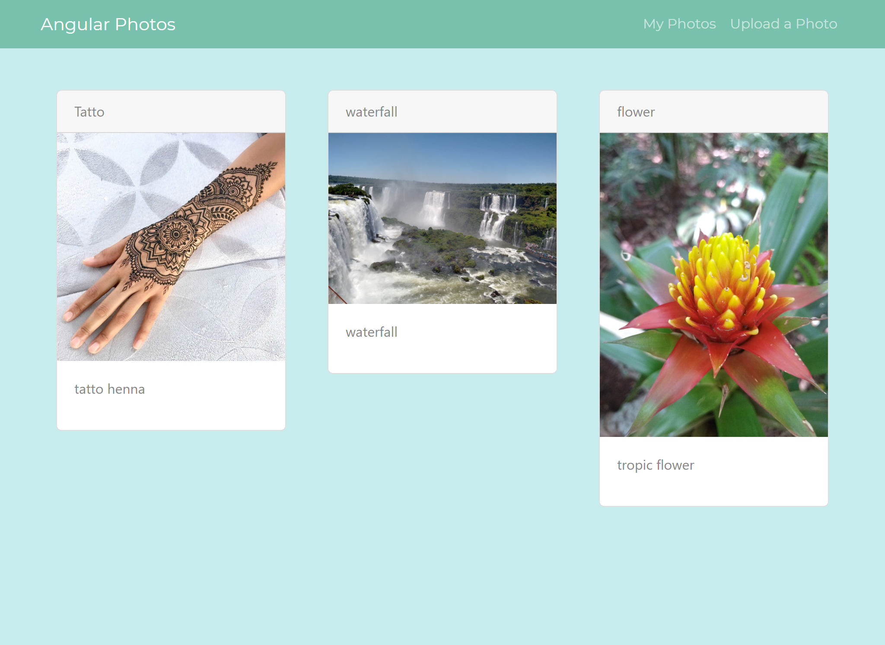

# MEAN Photo Gallery

Image App made with Angular, Nodejs, Mongodb, Express & Typescript (Stack MEAN).



This project was generated with [Angular CLI](https://github.com/angular/angular-cli) version 8.3.0.
## Web server installation
```
git clone https://github.com/gdys92/mean-photo-gallery
cd api
npm install
mongod
npm start
```

##frontend:
```
cd angular-gallery
npm install
ng serve
```
  